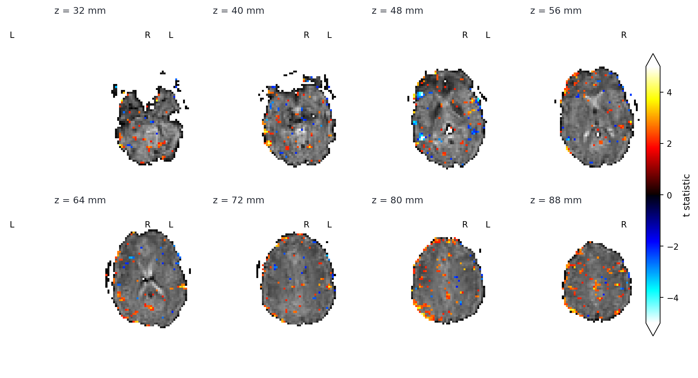

::: {.hero}
::: {.hero-copy}

```{=html}
<h1>fMRI design and statistical modeling in Python</h1>
```

[Construct HRFs, design matrices and contrasts as inspectable Python objects, fit first-level and group models, and examine the design at each stage.]{.lead}

[Get started →](get-started.qmd){.btn .btn-primary}
[API reference](reference/index.qmd){.btn .btn-outline-secondary}

[HRFs]{.kicker} [design matrices]{.kicker} [first-level GLM]{.kicker} [contrasts]{.kicker}
:::
::: {.hero-code}
::: {.code-card}
[quickstart.py]{.code-card-title}
```python
import numpy as np
import pandas as pd
import fmrimod as fm
from fmrimod.spec import hrf
from fmrimod.contrast import condition

events = pd.DataFrame({
    "onset": [8., 20., 32., 44.],
    "duration": 2.,
    "condition": ["face", "scene", "face", "scene"],
})
bold = np.random.default_rng(7).normal(size=(60, 4))
dataset = fm.fmri_dataset(bold, tr=1.0, events=events)

fit = fm.fmri_lm(hrf("condition", basis="spmg1"), dataset)
result = fit.contrast(
    condition("face", term="condition")
    - condition("scene", term="condition"),
)
result.estimate
```
:::
:::
:::

::: {.proof-feature}
::: {.proof-feature-visual}
```{=html}
<a href="tutorials/real-data-fiac.qmd" aria-label="Open the real FIAC analysis">
  
</a>
```
:::
::: {.proof-feature-copy}
## From typed contrast to brain image

Fit both runs of a published FIAC experiment, pool named sentence and speaker
effects, restore the statistic through the fitted masker, and compare the
same task with its checked-in Nilearn parity receipt.

[Run the real-data tutorial →](tutorials/real-data-fiac.qmd)
:::
:::

## The design is a value {.promise-heading}

A design in fmrimod is a **first-class Python value**, not a magic string. You
build it from `hrf(...)`, `drift(...)`, `intercept(...)` terms, compose them
with `+`, and inspect every field before a single coefficient is solved.

```{python}
import numpy as np
import pandas as pd
import fmrimod as fm
from fmrimod.spec import hrf
from fmrimod.contrast import condition

events = pd.DataFrame({
    "onset": np.arange(8, 116, 12.0),
    "condition": "face",
    "duration": 2.0,
})

# Author the design, then read its declared fields; no string parsing.
design = hrf("condition", basis="spmg1")
design.variables, design.hrf
```

We use only public APIs to generate data with a **known** face-versus-baseline
effect of `2.0` in two of four features. A correct fit should recover values
near `2.0` in the first two and near zero in the other two.

```{python}
from fmrimod.spec import compile as compile_spec
from fmrimod.simulate import simulate_bold

sampling = fm.SamplingFrame(blocklens=130, TR=1.0)
built, _ = compile_spec(design, data=events, sampling_frame=sampling)
bold = simulate_bold(
    np.asarray(built.design_matrix),
    np.array([[2.0, 2.0, 0.0, 0.0]]),
    noise_sd=0.3,
    n_voxels=4,
    rng=np.random.default_rng(7),
)
dataset = fm.fmri_dataset(bold, tr=1.0, events=events)
```

```{python}
fit = fm.fmri_lm(design, dataset)
faces = fit.contrast(
    condition("face", term="condition"), name="face_vs_baseline"
)
pd.DataFrame({
    "estimate": faces.estimate.round(3),
    "t": faces.stat.round(2),
    "p": faces.p_value.round(4),
})
```

::: {.callout-note collapse="true"}
## Coming from R / `fmrireg`?

The R-style string formula still works and compiles to the *same* Spec
tree: `fm.fmri_lm("hrf(condition)", dataset)` is exact sugar for
`fm.fmri_lm(hrf("condition"), dataset)`. Prefer the object form in Python:
it is composable, IDE-introspectable, and inspectable before fitting.
:::

## Design principles {.promise-heading}

::: {.promise-grid}
::: {.promise-card}
### Typed
HRFs, baselines, contrasts, AR options, single-trial estimators and group
reductions are Python objects that can be inspected. They are constructed
once and validated at construction. [Get started](get-started.qmd)

[`hrf("condition")`]{.promise-tag}
:::
::: {.promise-card}
### Composable
Terms combine with `+` into a single design. The same sequence,
`fmri_dataset → fmri_lm → contrast result → group dataset`, carries semantic
intent and provenance from authored hypothesis to group-ready evidence; the
[golden path](tutorials/golden-path.qmd) works through this end to end on a
dataset with a known effect.

[`hrf(...) + drift(...)`]{.promise-tag}
:::
::: {.promise-card}
### Checked against references
Nilearn, FitLins and the corresponding R implementations are treated as
references. Agreement is recorded in checked-in benchmark and cross-testing
artifacts rather than asserted.
[Workflow overview](tutorials/overview-workflow.qmd)
[Real FIAC analysis](tutorials/real-data-fiac.qmd)

[`fm.design_matrix`]{.promise-tag}
:::
:::

::: {.callout-note}
## Alpha, with visible evidence

fmrimod is source-installable alpha software, not a PyPI release. The
[evidence ledger](evidence/index.qmd) separates verified behavior from work
that has not been run, while the
[active caveats](https://github.com/bbuchsbaum/fmrimod/blob/main/docs/contracts/CAVEATS.md)
name the owner and exit criterion for every accepted parity exception.
:::

fmrimod brings HRF specification, design construction, first-level and
group modeling into a single Python library. Capabilities that are spread
across several R packages are consolidated here under one API, designed
around explicit composition and reproducible analysis objects rather than
translated directly.
